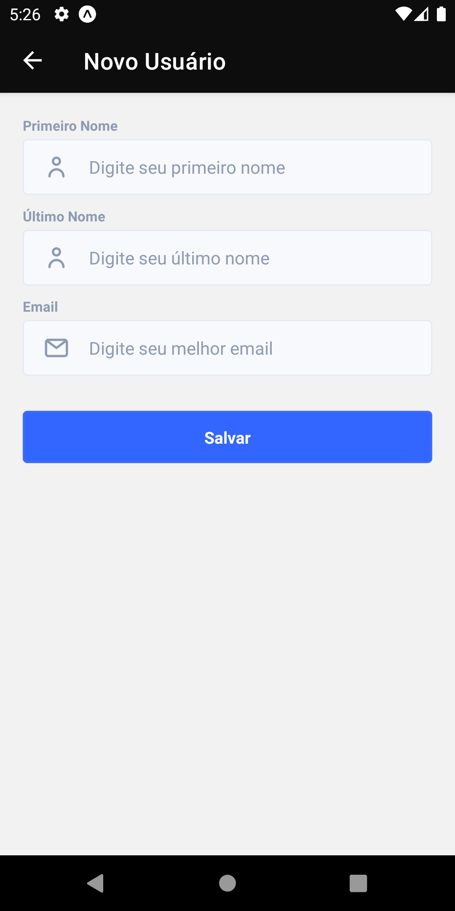

<h1 align="center"> Users app - mobile 📱</h1>

<h2 align="center">
    Visualize and manage your users
</h2>

<h3 align="center">
  Built using React Native and Expo.
</h3>

# Cloning this repository

```
git clone https://github.com/pedromarquex/users-app-mobile.git
```


# ❗️ Requisites

To run this app, you need to have the following dependencies installed:
- [Node](https://nodejs.org/en/)

## 💻 Mobile App

<p>
  In this project we use:
</p>

- [React Native](https://reactnative.dev/)
- [Expo](https://expo.dev/)
- [TypeScript](https://www.typescriptlang.org/) for types
- [UI Kitten ](https://akveo.github.io/react-native-ui-kitten/) for UI components
- [React Navigation](https://reactnavigation.org/) for navigation
- [Axios](https://axios-http.com/) for HTTP requests
- [date-fns](https://date-fns.org/) for date manipulation

### ⚡️ Start

To start application, run:

```
cd users-app-mobile

expo install
npm run start

```
# Screenshot

<h1 align="center">
    
</h1>
